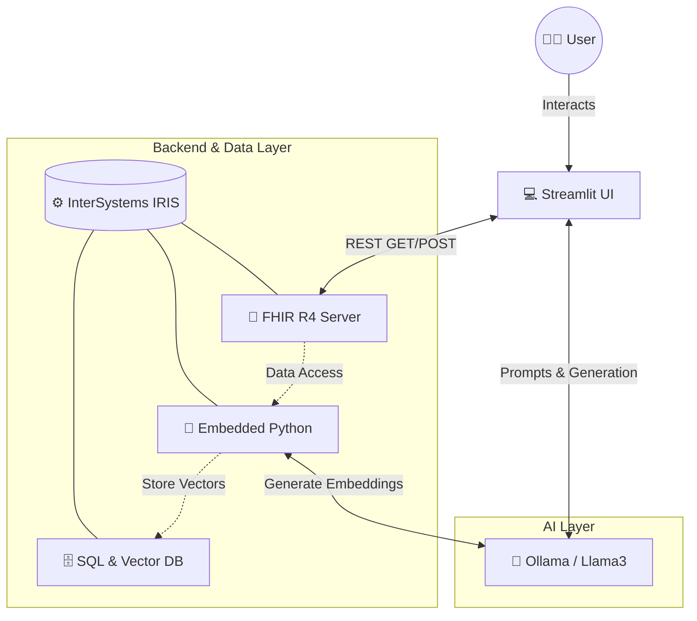
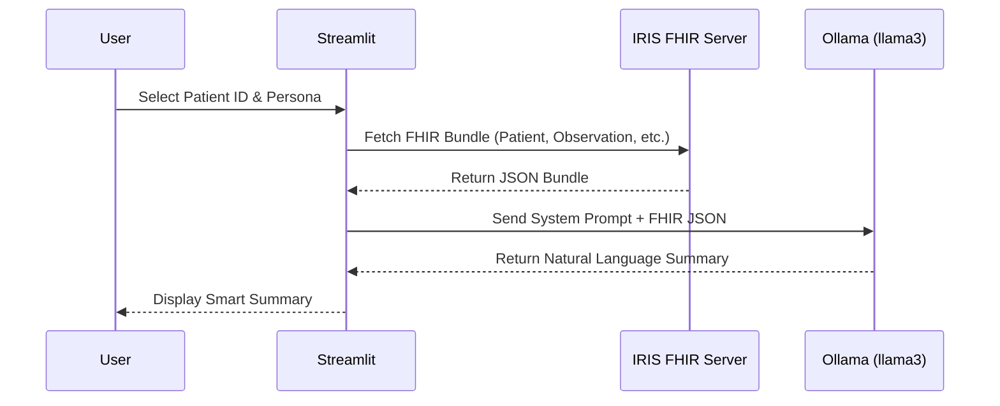
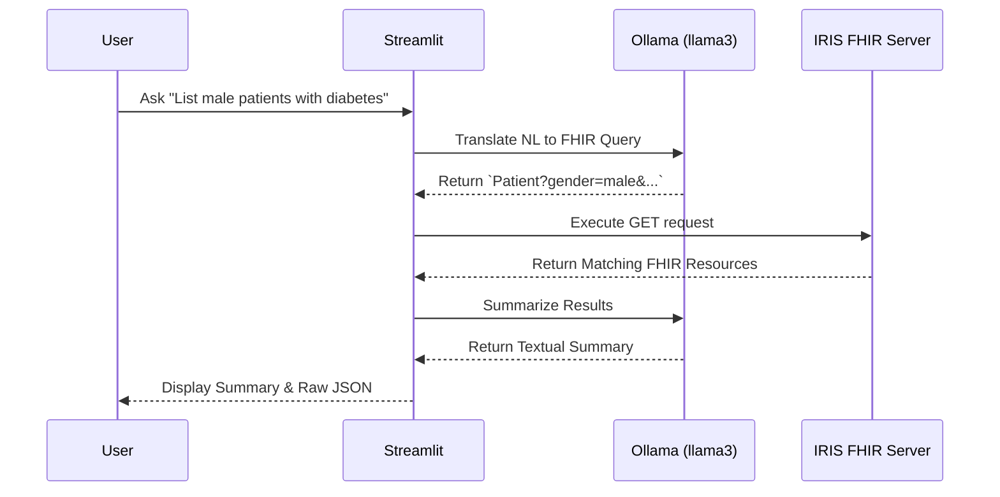
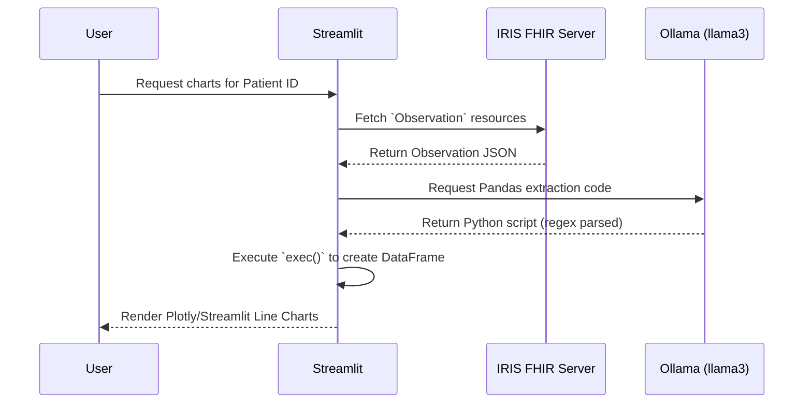

# 🏥 FHIR Assistant: Application Architecture & AI Integration

This document provides a high-level overview of the **FHIR Assistant** architecture, highlighting the integration of Large Language Models (LLMs) with standard healthcare interoperability protocols.

---

## 🏗️ High-Level Architecture

At its core, the application integrates a frontend UI, an AI engine, and a robust multi-model data platform.

---

## 🌟 The Importance of InterSystems IRIS

**InterSystems IRIS** is not just a database in this architecture; it is the foundational integration engine that makes the entire application possible. Its capabilities eliminate the need for complex middleware.

### 1. Out-of-the-Box FHIR Capabilities
* **Standardization:** IRIS provides a fully compliant HL7 FHIR R4 server natively. The application doesn't need custom parsers to understand `Patient`, `Observation`, or `Condition` resources.
* **Interoperability:** By standardizing the data layer, the application is inherently interoperable and ready to plug into external hospital networks.
* **Native Ingestion:** IRIS enables bulk FHIR resource ingestion with built-in tools (e.g., `HS.FHIRServer.Tools.DataLoader`), smoothly transitioning raw JSON into accessible REST endpoints.

### 2. Multi-Model Data Platform
* **Unified Storage:** IRIS flawlessly handles document-based data (FHIR JSON), relational data (SQL Tables), and modern AI structures (Vector Embeddings) simultaneously.
* **Vector Search:** With the `TO_VECTOR()` SQL function, IRIS stores high-dimensional embeddings generated by Ollama directly into the `SQLUser.PatientSummary` table. This paves the way for semantic searches across clinical records.

### 3. Embedded Python
* **Proximity to Data:** The `VectorizePatients` method runs Python *natively* inside the IRIS kernel. 
* **Reduced Latency:** Extracting FHIR data, calling an external LLM for embeddings, and writing back to SQL happens within a single, highly performant process without network hops between the database and a backend server.

---

## 🔄 Application Workflows

### Tab 1: Smart Patient Summary Generator
Translates complex FHIR bundles into role-specific, human-readable clinical summaries using the LLM.

### Tab 2: Natural Language to FHIR Query Explorer
Empowers users to query the FHIR server without knowing complex FHIR search parameter syntax.

### Tab 3: AI-Assisted Observation Charts
Uses AI to dynamically write Python code that transforms raw FHIR JSON into structured DataFrames and visualizations.

---

## 🚀 Future Scalability
Because of this architecture, expanding the application is highly straightforward. Changing the LLM requires updating a single endpoint configuration. Integrating a new hospital means simply pointing their data feed to the IRIS FHIR server endpoint.